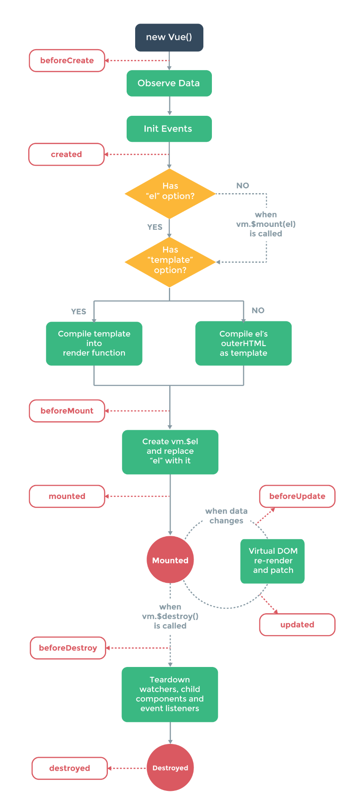

### 实例
---

- 构造器

    每个vuejs应用都是通过构造函数Vue创建Vue的根实例启动的。可以扩展Vue构造器，实现用预定义选项创建可复用的组件构造器：
    ```
    var MyComponent = Vue.extend({
        // 扩展选项
    });

    // 所有的MyComponent实例都将以预定义的扩展选项被创建
    var myComponentInstance = new MyComponent();
    ```
    在多数情况下将组件构造器注册为一个自定义元素，然后声明式地用在模板中。所有Vuejs组件都是被扩展的Vue实例。

- 属性与方法

    只有被代理的属性是响应的，如果在实例创建之后添加新的属性到实例上，不会触发视图更新。

    *不要在实例属性或回调函数中(如：vm.$watch('a', newVal => this.myMethod()))使用箭头函数，因为箭头函数绑定父上下文，this将不再是Vue实例，而是this.myMethod未被定义。*

- 生命周期

    每个Vue实例被创建之前都经过一系列的初始化过程，如实例需要配置数据观测、编译模板、挂载实例到DOM，然后在数据变化时更新DOM。Vuejs没有控制器的概念，组件的自定义逻辑可以分布在生命周期的钩子中。

- 生命周期图示：
    
